# Spring Boot Backup Script

Ansible-based backup management system for Spring Boot applications.

## Purpose and Goals

This project provides a centralized backup management solution for multiple Spring Boot applications deployed across different servers. It aims to:

1. **Automate database and file backups** - Schedule daily backups of PostgreSQL/MariaDB databases and application files without manual intervention
2. **Ensure data security** - Encrypt all cloud-stored backups using GPG symmetric encryption, ensuring data at rest is protected even if cloud storage is compromised
3. **Support multiple cloud providers** - Distribute backups across Backblaze B2, Google Drive, and AWS S3 for redundancy
4. **Isolate per-application credentials** - Each application has its own encryption keys, database credentials, and cloud storage credentials
5. **Provide visibility** - Generate reports showing backup status, file counts, and cloud sync status across all managed applications
6. **Enable disaster recovery** - Restore from local or cloud backups with checksum verification

## Architecture

```mermaid
flowchart TB
    subgraph CONTROL["CONTROL MACHINE (Admin Workstation)"]
        subgraph REPO["spring-boot-backup-script/"]
            INV["inventories/<br/>├── app1/<br/>├── app2/<br/>└── app3/"]
            PLAY["playbooks/<br/>setup, backup, report"]
            ROLE["roles/backup/<br/>tasks, templates"]
        end
        ANSIBLE["ansible-playbook"]
    end

    subgraph SERVER["TARGET SERVER"]
        subgraph APP_LAYER["Application Layer"]
            SPRINGBOOT["Spring Boot<br/>Application"]
            DB[("Database<br/>PostgreSQL/<br/>MariaDB")]
            DOCS["Documents<br/>/uploads"]
        end

        subgraph BACKUP_PROCESS["Backup Process"]
            BACKUP_SH["backup.sh<br/>(cron 02:00)<br/>─────────────<br/>1. pg_dump/mysqldump<br/>2. tar documents<br/>3. manifest.json<br/>4. create .tar.gz"]
        end

        subgraph LOCAL["LOCAL STORAGE<br/>/opt/app/backup/"]
            LOCAL_FILES["*.tar.gz<br/>(unencrypted)<br/>retention: 7 days"]
        end

        subgraph SYNC_PROCESS["Cloud Sync Process"]
            CLOUD_SH["cloud-sync.sh<br/>(cron 03:00)<br/>─────────────<br/>1. GPG encrypt<br/>2. rclone upload<br/>3. cleanup old"]
        end
    end

    subgraph CLOUD["CLOUD STORAGE (GPG Encrypted)"]
        B2["Backblaze B2<br/>*.tar.gz.gpg<br/>retention: 4 weeks"]
        GDRIVE["Google Drive<br/>*.tar.gz.gpg<br/>retention: 12 months"]
        S3["AWS S3<br/>*.tar.gz.gpg<br/>retention: 30 days"]
    end

    REPO --> ANSIBLE
    ANSIBLE -->|SSH| SERVER
    DB --> BACKUP_SH
    DOCS --> BACKUP_SH
    BACKUP_SH --> LOCAL_FILES
    LOCAL_FILES --> CLOUD_SH
    CLOUD_SH -->|HTTPS| B2
    CLOUD_SH -->|HTTPS| GDRIVE
    CLOUD_SH -->|HTTPS| S3
```



### Data at Rest Encryption

| Location | Encryption | Details |
|----------|------------|---------|
| **Cloud Storage** | GPG symmetric (AES-256) | Per-app passphrase stored in Ansible Vault |
| **Local Storage** | Unencrypted | Protected by OS file permissions (mode 0600, app user only) |

## Repository Contents

### Committed Files (Version Controlled)

These files are safe to commit and share publicly:

```
spring-boot-backup-script/
├── ansible.cfg                 # Ansible configuration
├── .gitignore                  # Git ignore rules
├── CLAUDE.md                   # Development instructions
├── README.md                   # This file
├── playbooks/
│   ├── setup.yml               # Deploy backup system to server
│   ├── backup.yml              # Trigger immediate backup
│   ├── restore.yml             # Restore from backup file
│   ├── report.yml              # Generate backup status report
│   ├── test.yml                # Verify backup configuration
│   └── generate-gpg-key.yml    # Generate GPG key for new app
├── roles/
│   └── backup/
│       ├── defaults/main.yml   # Default variable values
│       ├── tasks/              # Ansible tasks
│       └── templates/          # Script templates (Jinja2)
└── scripts/
    ├── new-app.sh              # Create new app inventory
    └── run-all.sh              # Run playbook on all apps
```

### Local-Only Files (Not Committed)

These files contain sensitive information and are excluded via `.gitignore`:

```
spring-boot-backup-script/
├── .vault_pass                         # Ansible Vault password (optional)
└── inventories/
    └── <app-name>/
        ├── hosts.yml                   # Server IP, SSH user
        └── group_vars/
            └── all/
                ├── main.yml            # App configuration (committed)
                └── vault.yml           # Encrypted secrets:
                                        #   - Database password
                                        #   - GPG encryption key
                                        #   - Cloud provider credentials
                                        #   - Telegram bot token
```

**Why these files are not committed:**
- `hosts.yml` - Contains server IP addresses and SSH usernames
- `vault.yml` - Contains all secrets (encrypted with Ansible Vault, but still sensitive)
- `.vault_pass` - Plain text vault password file (optional, for non-interactive execution)

---

# User Manual

## 1. Clone and Setup

### Prerequisites

- Ansible 2.14+ installed on control machine
- SSH access to target servers
- Target servers: Debian/Ubuntu with `pg_dump`/`mysqldump`, `rclone`, `gpg`, `bc` installed

### Clone Repository

```bash
git clone https://github.com/artivisi/spring-boot-backup-script.git
cd spring-boot-backup-script
```

### Verify Ansible Installation

```bash
ansible --version
# Should show Ansible 2.14 or higher
```

### (Optional) Create Vault Password File

For non-interactive execution, create a vault password file:

```bash
echo "your-vault-password" > .vault_pass
chmod 600 .vault_pass
```

This file is already in `.gitignore` and will not be committed.

## 2. Add New App Instance

### Generate Inventory Scaffold

```bash
./scripts/new-app.sh myapp
```

This creates:
```
inventories/myapp/
├── hosts.yml                    # Server connection info
└── group_vars/
    └── all/
        ├── main.yml             # App configuration
        └── vault.yml            # Secrets template
```

### Configure Server Connection

Edit `inventories/myapp/hosts.yml`:

```yaml
all:
  hosts:
    prod:
      ansible_host: 192.168.1.100      # Server IP or hostname
      ansible_user: deploy              # SSH username
      ansible_python_interpreter: /usr/bin/python3
```

### Configure Application Settings

Edit `inventories/myapp/group_vars/all/main.yml`:

```yaml
# Application identity
app_name: myapp
app_user: "{{ vault_app_user }}"
app_base_path: /opt/myapp

# Database configuration
db_type: postgres                       # postgres | mariadb
db_name: "{{ vault_db_name }}"
db_user: "{{ vault_db_user }}"
db_host: localhost
db_port: 5432                           # 5432 for postgres, 3306 for mariadb

# Backup scope
backup_documents: true
backup_documents_path: "{{ app_base_path }}/documents"
backup_jar: false
backup_nginx: true
backup_systemd: true

# Local retention
local_backup_path: "{{ app_base_path }}/backup"
local_retention_count: 7

# Cloud providers (enable as needed)
cloud_b2_enabled: true
cloud_gdrive_enabled: true
cloud_s3_enabled: false

# Cron schedule
backup_cron_hour: 2
backup_cron_minute: 0
cloud_sync_cron_hour: 3
cloud_sync_cron_minute: 0
```

### Configure Secrets

Edit `inventories/myapp/group_vars/all/vault.yml` with your secrets:

```yaml
# Application
vault_app_user: "myapp"

# Database
vault_db_name: "myappdb"
vault_db_user: "myapp"
vault_db_password: "your-database-password"

# GPG key for backup encryption (generate with: openssl rand -base64 32)
vault_gpg_key: "your-random-gpg-passphrase"

# Backblaze B2 (if cloud_b2_enabled)
vault_b2_bucket: "your-bucket-name"
vault_b2_path: "myapp"
vault_b2_account_id: "your-account-id"
vault_b2_app_key: "your-app-key"

# Google Drive (if cloud_gdrive_enabled)
vault_gdrive_folder: "backup-myapp"
vault_gdrive_token: '{"access_token":"...","token_type":"Bearer",...}'

# AWS S3 (if cloud_s3_enabled)
vault_s3_bucket: "your-bucket"
vault_s3_access_key: "AKIA..."
vault_s3_secret_key: "your-secret-key"

# Telegram notifications
vault_telegram_bot_token: "123456789:ABC..."
vault_telegram_chat_id: "your-chat-id"
```

### Encrypt Vault File

```bash
ansible-vault encrypt inventories/myapp/group_vars/all/vault.yml
```

You will be prompted to create a vault password. Store this password securely (e.g., in Bitwarden).

## 3. Run Setup

Setup deploys backup scripts, cron jobs, and cloud provider configurations to the target server.

### Single App Setup

```bash
# With interactive password prompt
ansible-playbook playbooks/setup.yml -i inventories/myapp/ --ask-vault-pass

# With password file
ansible-playbook playbooks/setup.yml -i inventories/myapp/ --vault-password-file .vault_pass
```

### All Apps Setup

```bash
./scripts/run-all.sh setup --ask-vault-pass
# or
./scripts/run-all.sh setup --vault-password-file .vault_pass
```

### Verify Setup

```bash
ansible-playbook playbooks/test.yml -i inventories/myapp/ --vault-password-file .vault_pass
```

Expected output shows:
- Database connectivity: successful
- B2/GDrive/S3 connectivity: passed (for enabled providers)

## 4. Run Backup Manually

Backups run automatically via cron (default: 02:00 daily). To trigger a manual backup:

### Single App Backup

```bash
ansible-playbook playbooks/backup.yml -i inventories/myapp/ --vault-password-file .vault_pass
```

### All Apps Backup

```bash
./scripts/run-all.sh backup --vault-password-file .vault_pass
```

### What Happens During Backup

1. Database dump is created (`pg_dump` or `mysqldump`)
2. Documents directory is archived
3. Optional: JAR, nginx config, systemd unit are included
4. `manifest.json` with SHA256 checksums is generated
5. Everything is packaged into `<app>_<timestamp>.tar.gz`
6. Old backups beyond retention count are deleted
7. Telegram notification is sent (if enabled)

## 5. Run and Read Report

### Generate Report

**Single app:**
```bash
ansible-playbook playbooks/report.yml -i inventories/myapp/ --vault-password-file .vault_pass
```

**All apps:**
```bash
./scripts/run-all.sh report --vault-password-file .vault_pass
```

### Understanding Report Output

```
============================================
Backup Report: myapp
Generated: 2026-01-02 18:23:37
============================================

Local Backups (/opt/myapp/backup):
  myapp_20260102_170809.tar.gz  3.29 MB  2026-01-02 17:08
  myapp_20260102_020001.tar.gz  3.28 MB  2026-01-02 02:00
  myapp_20260101_020001.tar.gz  3.28 MB  2026-01-01 02:00

  Total: 3 files, 9.85 MB

Cloud Status:
  B2: 3 files
    Oldest: myapp_20260101_020001.tar.gz.gpg
    Newest: myapp_20260102_170809.tar.gz.gpg
  GDrive: 30 files
    Oldest: myapp_20251201_020001.tar.gz.gpg
    Newest: myapp_20260102_170809.tar.gz.gpg

Last Backup:
  Timestamp: 2026-01-02T17:08:09+07:00
  Database checksum: a1b2c3d4e5f6...

Recent Log Entries:
  [2026-01-02 03:00:07] B2: B2 upload completed: myapp_20260102_020001.tar.gz.gpg
  [2026-01-02 04:00:05] GDrive: Google Drive upload completed: myapp_20260102_020001.tar.gz.gpg

============================================
```

### Report Sections Explained

| Section | Description |
|---------|-------------|
| **Local Backups** | Files stored on the server, with size and date. These are unencrypted. |
| **Total** | Count and total size of local backups |
| **Cloud Status** | Number of files in each cloud provider, oldest and newest backup names |
| **Last Backup** | Metadata from the most recent backup's manifest.json |
| **Recent Log Entries** | Last 20 lines from backup log showing recent activity |

### Troubleshooting Reports

| Symptom | Cause | Solution |
|---------|-------|----------|
| Cloud shows 0 files | rclone config permission issue | Re-run setup playbook |
| Missing cloud provider | Provider not enabled | Set `cloud_*_enabled: true` in main.yml |
| Empty log entries | No backups have run yet | Wait for cron or run manual backup |

## License

Apache License 2.0
